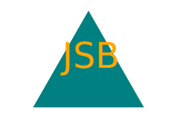
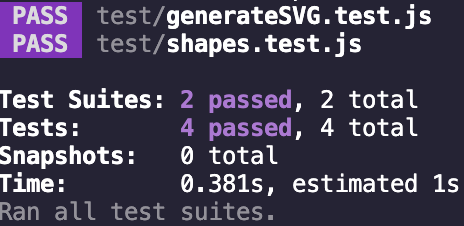

# SVG Logo Generator   
A quick SVG logo generator that runs from the command line. 

## Description:
This application uses node.js to create a simple logo SVG file. It uses inquirer to prompt the user for 3 characters, the text color, a shape, and the shape color, then generates a logo.svg file based on the responses. 

This is a exercise in using objects with node.js. It is also a practice in implementing testing using jest. 

## Table of Contents:
  - [Installation](#installation)
  - [Usage](#usage)
  - [Demonstration](#demonstration)
  - [Tests](#tests)
  - [License](#license)

## Installation:
This application requires using inquirer and jest for testing, use "npm i" to install the required dependencies.

## Usage:
Invoke the file with "node index.js". It will then prompt you with four questions, then generate the SVG file. 

## Demonstration:
[Here is a video demonstration of my application](https://drive.google.com/file/d/1a0TOC8dKLGHN1bzaTj2LX4iKeHg_MRq5/view)

## Tests:
Run test using npm test. Testing is ran with jest. 
Tests for the Triangle, Square, and Circle shapes being generated, also test for the generation of a correct SVG file. 

## License:
-[MIT](https://opensource.org/license/mit/) 

### Enjoy!

